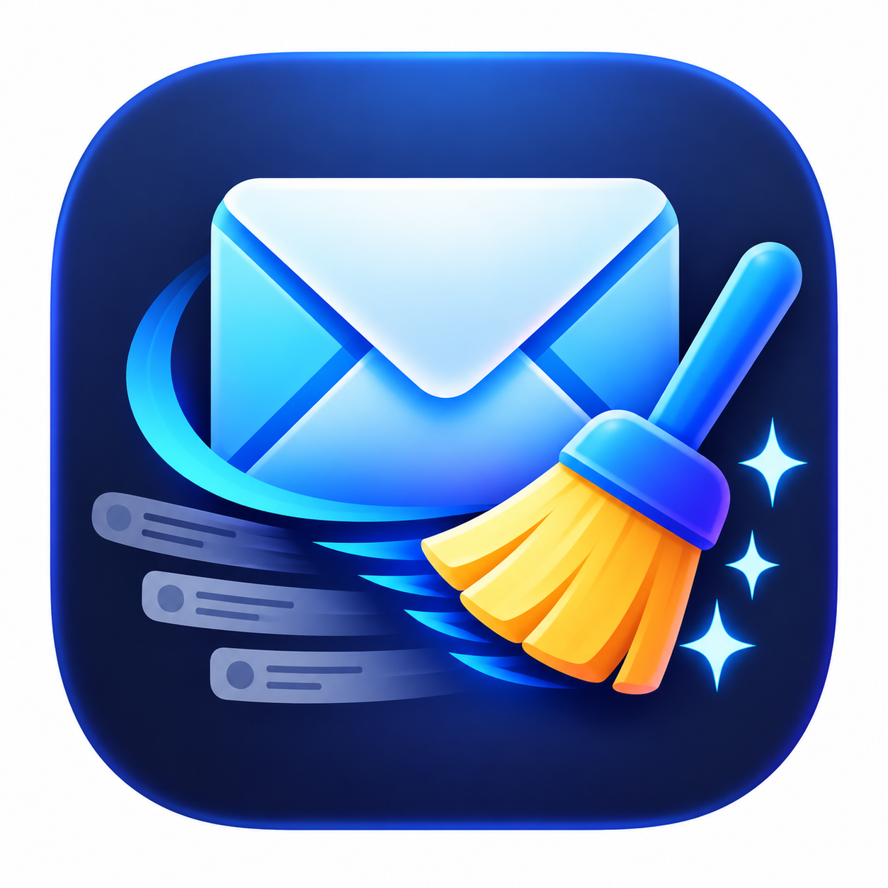

<p align="center">
  
</p>

# Gmail Quote Cleaner (with exceptions)

An open-source Chrome extension that automatically removes quoted text when you reply to emails in Gmail. Unlike other cleaners, this extension allows you to maintain a **whitelist (exceptions list)** of specific senders. If you reply to a sender on your list, the original quoted text is preserved.

## Features

- **Automated Cleanup:** Instantly removes the quoted text block when you click reply, keeping threads tidy.
- **Smart Exceptions:** Specify email addresses (e.g., clients, managers) via the popup. Quotes from these senders are left intact.
- **Privacy First:** Data is saved locally using Chrome's `storage.sync`. No data leaves your machine, and the extension never reads email contents—only the sender's address.
- **Multi-language Support (i18n):** Automatically adapts to your browser language (supports English, Spanish, French, German, Hebrew, and Portuguese).
- **Non-intrusive:** Reads the sender directly from the rendered message header without expanding the quote block first.

---

## Installation

### Option 1: Download from Releases (Recommended)

1. [**Download `gmail-quote-cleaner.zip` directly**](https://github.com/csh-tech/gmail-quote-cleaner/releases/latest/download/gmail-quote-cleaner.zip) (or visit the [**Latest Releases**](https://github.com/csh-tech/gmail-quote-cleaner/releases/latest) page).
2. Unzip the file to a permanent folder on your computer (do not delete or move this folder later).
3. Open Google Chrome and go to `chrome://extensions/`.
4. Turn on **Developer mode** in the top-right corner.
5. Click **Load unpacked** in the top-left corner.
6. Select the unzipped folder.
7. Pin the extension to your toolbar, reload any open Gmail tabs, and you're all set!

### Option 2: Clone the Repository (For Developers)

```bash
git clone https://github.com/csh-tech/gmail-quote-cleaner.git
cd gmail-quote-cleaner
```
Then follow steps 4–8 above pointing to the cloned repository folder.

---

## How to Use

1. Click the **Gmail Quote Cleaner** icon in your Chrome toolbar.
2. Enter the email addresses you want to exclude (one email address per line).
3. Click **Save Settings**.
4. Whenever you reply to an email from anyone *not* on that list, quoted text is automatically stripped.

---

## How It Works Under the Hood

- The content script (`content.js`) periodically scans the DOM for unhandled "..." (trim) buttons.
- It traverses the message hierarchy to read the sender's email from the existing header DOM.
- If the sender is in your exception list, the trim button is left untouched.
- If the sender is not excluded, the button is triggered and a `MutationObserver` instantly purges the quote block before visual rendering completes.

---

## Known Limitations

- **DOM Class Dependency:** Sender detection relies on Gmail's current DOM markup (`span.gD[email]`, `div.adn`, etc.). If Gmail pushes an interface update, selectors may require minor adjustments.
- **Exact Matches Only:** Senders must match full email addresses (case-insensitive). Wildcard/domain-level rules (e.g., `@company.com`) are not yet implemented.
